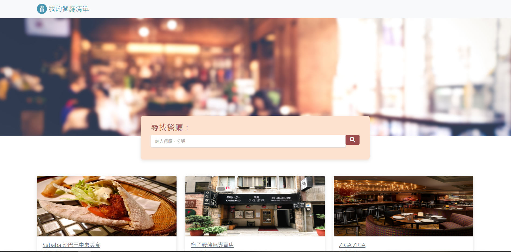

# Restaurant List

打造餐廳清單

## Features

-   顯示全部餐廳
-   顯示個別餐聽
-   透過餐廳名稱、餐廳類別，搜尋特定餐廳

## Screen



## Get started

### 1. Clone 專案

開啟終端機(Terminal)cd 到存放專案本機位置並執行:

```
git clone https://github.com/DannyChouYs/restaurant_list.git
```

### 2. 安裝

`npm install`

### 3. 啟動

`npm run dev`

## 使用套件

-   VScode - 開發環境
-   Express.js - 應用程式架構
-   Express-handlebars - 模板引擎
-   nodemon - 自動化 reload
-   bootstrap5 - 優化界面

## 作者

DannyChou
